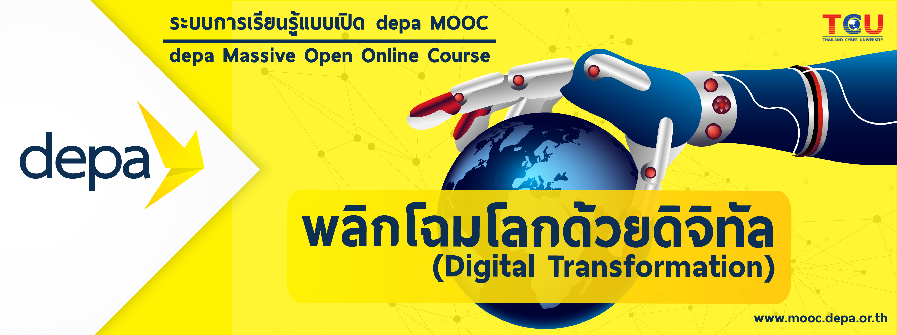

## **[Digital Transformation](https://thaimooc.org/courses/course-v1:DEPA-MOOC+depa002+T1_2018/about)**

ถือเป็นครั้งแรกกับการเข้ามาเรียนในระบบ MOOC (ที่ชื่อระบบมีคำว่า MOOC) กับรายวิชา [**พลิกโฉมโลกด้วยดิจิทัล - : Digital Transformation**](https://thaimooc.org/courses/course-v1:DEPA-MOOC+depa002+T1_2018/about)

[[Certificate](https://thaimooc.org/edxphp/getcer/725198503f2100d7f3c1bf6c2cbc8ba86024c158)] of Completion